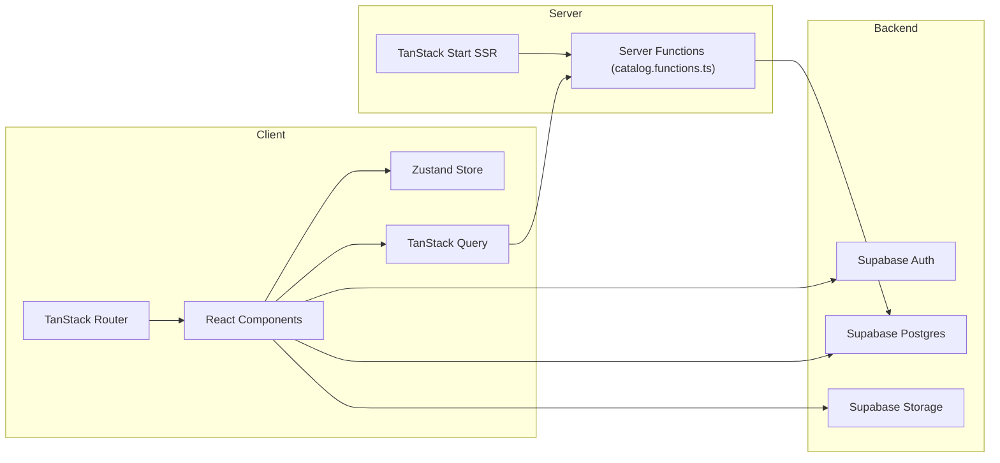
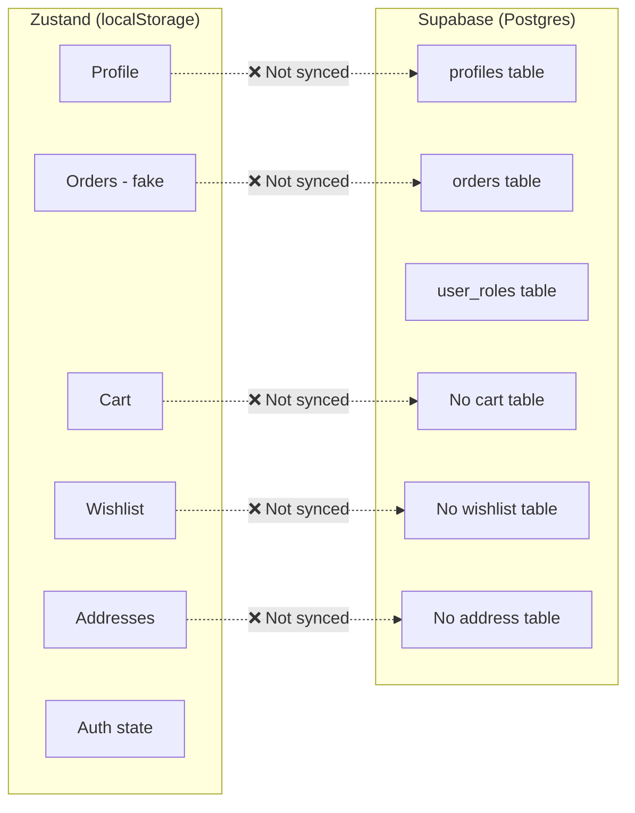

# MotoHelm E-Commerce — Comprehensive Analysis Report

> **Application**: MotoHelm — Premium Motorcycle Helmet E-Commerce Store  
> **Stack**: TanStack Start (React 19) · Supabase (Auth + Postgres + Storage) · Zustand · TailwindCSS v4 · Framer Motion · Recharts  
> **Generated**: June 18, 2026

---

## Table of Contents

1. [Architecture Overview](#1-architecture-overview)
2. [Supabase Schema Analysis](#2-supabase-schema-analysis)
3. [Security Issues](#3-security-issues)
4. [Frontend & UX Issues](#4-frontend--ux-issues)
5. [State Management Issues](#5-state-management-issues)
6. [Performance Issues](#6-performance-issues)
7. [Admin Panel Issues](#7-admin-panel-issues)
8. [Data Integrity & Business Logic Issues](#8-data-integrity--business-logic-issues)
9. [Code Quality & Maintainability](#9-code-quality--maintainability)
10. [SEO & Accessibility](#10-seo--accessibility)
11. [Missing Features](#11-missing-features)
12. [Priority Improvement Roadmap](#12-priority-improvement-roadmap)

---

## 1. Architecture Overview



### What's Good ✅

| Area | Strength |
|------|----------|
| **Design System** | Exceptional dark-mode racing aesthetic with custom OKLCH color palette, carbon-fiber textures, and fire gradients |
| **Typography** | Three-font system (Bebas Neue + Inter + JetBrains Mono) is cohesive and brand-aligned |
| **SSR / Data Loading** | Server functions via TanStack Start for catalog reads — good for SEO and initial load |
| **Schema Design** | Solid foundational tables with proper RLS, `SECURITY DEFINER` helper functions, and cascading deletes |
| **Realtime** | Catalog changes broadcast via Supabase realtime channels with smart debouncing |
| **Seed Data** | Idempotent seed migrations with `ON CONFLICT DO NOTHING` — production-safe |
| **Admin Panel** | Functional CRUD for products, orders, brands, categories with drawer-based UI |
| **Product Detail** | Lightbox with pinch-zoom, swipe navigation, keyboard shortcuts — premium feel |

---

## 2. Supabase Schema Analysis

### 2.1 Current Tables (from migrations)

| Table | Status | Notes |
|-------|--------|-------|
| `user_roles` | ✅ Complete | RBAC with `admin`/`staff`/`customer` roles |
| `profiles` | ⚠️ Incomplete | Missing `address` fields, no `gender` or `dob` |
| `brands` | ✅ Complete | Slug-indexed, RLS-protected |
| `categories` | ✅ Complete | Self-referential `parent_id` for hierarchy |
| `products` | ✅ Mostly complete | Has `specs` JSONB, `certifications` array |
| `product_images` | ✅ Complete | Positional ordering |
| `product_variants` | ⚠️ Partial | No `weight`, no `is_active` flag |
| `orders` | ✅ Mostly complete | Good status enums, JSONB addresses |
| `order_items` | ✅ Complete | Snapshot fields for name/image |
| `returns` | ⚠️ Partial | No `return_items` table, no `images` |
| `product_reviews` | ✅ Complete | Rating constraint, verified flag |
| `settings` | ✅ Complete | Store-wide config singleton |

### 2.2 Missing Tables & Schema Gaps

> [!CAUTION]
> The following tables are **missing entirely** and are critical for a production ecommerce platform:

#### ❌ Missing Tables

```mermaid
graph TD
    A["❌ coupons / discount_codes"] --> B["No promo code system at all"]
    C["❌ wishlists (DB)"] --> D["Wishlist is client-only in Zustand — lost on device switch"]
    E["❌ cart (DB)"] --> F["Cart is client-only — lost on device switch"]
    G["❌ addresses (DB)"] --> H["Addresses in Zustand, not synced to Supabase"]
    I["❌ order_status_history"] --> J["No audit trail for status changes"]
    K["❌ inventory_transactions"] --> L["No stock movement audit"]
    M["❌ newsletter_subscribers"] --> N["Email form on homepage does nothing"]
    O["❌ return_items"] --> P["Returns have no line-item granularity"]
    Q["❌ shipping_zones / rates"] --> R["Flat-rate only, no zone-based shipping"]
    S["❌ payment_transactions"] --> T["No payment gateway integration records"]
    U["❌ product_tags"] --> V["No tagging system for cross-category discovery"]
    W["❌ page_content / cms_blocks"] --> X["About, Blog, Contact are hardcoded"]
```



#### ⚠️ Schema Deficiencies in Existing Tables

| Issue | Table | Detail |
|-------|-------|--------|
| **No `weight` column** | `products` | Can't calculate shipping by weight |
| **No `sku` on products** | `products` | SKU only on variants; base product has none |
| **No `meta_title` / `meta_description`** | `products`, `categories` | SEO metadata hardcoded or absent |
| **No `is_active` flag** | `product_variants` | Can't disable individual variants |
| **No `barcode` / `ean`** | `product_variants` | No barcode tracking for inventory |
| **Rating not auto-computed** | `products` | `rating` and `reviews_count` are manually set, not triggers |
| **`compare_price` not validated** | `products` | No CHECK constraint that `compare_price > price` |
| **Order number collision risk** | `orders` | `random()` based — can generate duplicates at scale |
| **No `cancelled_at` / `delivered_at`** | `orders` | Can't track timeline of status changes |
| **No `return_items` join table** | `returns` | Can't return individual items from a multi-item order |
| **Missing indexes** | `product_reviews` | No index on `(product_id, rating)` for rating aggregation |
| **No full-text search** | `products` | No `tsvector` column — search uses `ILIKE` which is slow |

#### ⚠️ Migration Conflicts

| Issue | Detail |
|-------|--------|
| **`has_role` grant flip-flop** | Migration 2 revokes `anon` access, Migration 5 re-grants it to `anon`. The anon grant is dangerous — `has_role` is `SECURITY DEFINER` and should never be callable by anonymous users |
| **Settings double-insert** | Migration 1 inserts a settings row, Migration 3 conditionally inserts another with different values (PKR currency). If migration 1 runs successfully, migration 3's `WHERE NOT EXISTS` prevents the update — so the store stays on USD even though PKR is intended |
| **Realtime publication** | Migration 6 adds realtime for 5 catalog tables but not `orders`, `returns`, or `product_reviews` |

---

## 3. Security Issues

> [!WARNING]
> Several of these are production-blocking security concerns.

### 3.1 Critical

| # | Issue | Location | Impact |
|---|-------|----------|--------|
| **S1** | **`has_role` callable by `anon`** | [Migration 5](file:///e:/lovable%20orange/chrome-chrome-main/ecommerce/supabase/migrations/20260618012002_837116ab-85bd-43cc-8ac6-1ce9e20a0680.sql) | Anonymous users can probe which users are admins via `has_role(target_uuid, 'admin')`. This `SECURITY DEFINER` function reads `user_roles` and should never be exposed to anon |
| **S2** | **Admin self-promotion** | [admin.tsx:31-34](file:///e:/lovable%20orange/chrome-chrome-main/ecommerce/src/routes/admin.tsx#L31-L34) | If no admins exist, any authenticated user is auto-promoted to admin. This is fine for dev but **must be removed** for production |
| **S3** | **No CSRF protection on checkout** | [checkout.tsx](file:///e:/lovable%20orange/chrome-chrome-main/ecommerce/src/routes/checkout.tsx) | Checkout form has zero server-side validation. No order is actually created in Supabase — it's purely client-side |
| **S4** | **`.env` committed to repo** | [.env](file:///e:/lovable%20orange/chrome-chrome-main/ecommerce/.env) | Supabase keys are in a committed `.env` file. While the anon key is public by design, this is bad practice for any future service-role keys |
| **S5** | **No rate limiting** | Server functions | No rate limiting on login, signup, or checkout |

### 3.2 Medium

| # | Issue | Location |
|---|-------|----------|
| **S6** | Password field pre-filled with placeholder dots | [login.tsx:65](file:///e:/lovable%20orange/chrome-chrome-main/ecommerce/src/routes/login.tsx#L65) |
| **S7** | No email verification enforcement — user is `signedIn` immediately after signup | [signup.tsx:43-45](file:///e:/lovable%20orange/chrome-chrome-main/ecommerce/src/routes/signup.tsx#L43-L45) |
| **S8** | Admin order updates have no optimistic locking — two admins can overwrite each other | [admin.orders.tsx:49-56](file:///e:/lovable%20orange/chrome-chrome-main/ecommerce/src/routes/admin.orders.tsx#L49-L56) |
| **S9** | Product delete doesn't check for existing orders referencing the product | [admin.products.tsx:102-108](file:///e:/lovable%20orange/chrome-chrome-main/ecommerce/src/routes/admin.products.tsx#L102-L108) |
| **S10** | No input sanitization on search — `ILIKE %${data.search}%` is safe from SQL injection via Supabase client, but `%` and `_` wildcards are not escaped | [catalog.functions.ts:88](file:///e:/lovable%20orange/chrome-chrome-main/ecommerce/src/lib/catalog.functions.ts#L88) |

---

## 4. Frontend & UX Issues

### 4.1 Checkout Flow — **Non-Functional**

> [!CAUTION]
> The checkout flow is the most critical gap. **No order is actually created in Supabase.** The entire flow is visual-only.

| Step | What happens | What should happen |
|------|-------------|-------------------|
| Shipping | Form renders, no validation | Validate + save address to `orders.shipping_address` |
| Payment | Card/mobile fields render | Integrate payment gateway (Stripe/local) |
| Place Order | Cart is cleared, fake order # shown | Create `orders` + `order_items` rows, decrement stock, send confirmation email |

### 4.2 Account Page — **Dual State Problem**

The account page uses **Zustand** for profile, addresses, and orders — completely **disconnected from Supabase**:

- `profile` → hardcoded `Alex Rivera` in Zustand, real user is in `auth.users` + `profiles` table
- `addresses` → stored in localStorage via Zustand, no `addresses` table exists
- `orders` → hardcoded 3 fake orders in Zustand, real orders are in `orders` table but never read on this page
- `signOut` → only clears Zustand flag, doesn't call `supabase.auth.signOut()`

### 4.3 Other UX Issues

| # | Issue | Location |
|---|-------|----------|
| **U1** | Newsletter form does nothing — `onSubmit={(e) => e.preventDefault()}` | [index.tsx:203](file:///e:/lovable%20orange/chrome-chrome-main/ecommerce/src/routes/index.tsx#L203) |
| **U2** | "Forgot password" shows a toast "Demo only" instead of actual reset flow | [login.tsx:71](file:///e:/lovable%20orange/chrome-chrome-main/ecommerce/src/routes/login.tsx#L71) |
| **U3** | Sizing Guide button does nothing | [product.$slug.tsx:237](file:///e:/lovable%20orange/chrome-chrome-main/ecommerce/src/routes/product.$slug.tsx#L237) |
| **U4** | Blog page is likely a placeholder | [blog.tsx](file:///e:/lovable%20orange/chrome-chrome-main/ecommerce/src/routes/blog.tsx) (2.2KB — too small for real content) |
| **U5** | About page is static/hardcoded | [about.tsx](file:///e:/lovable%20orange/chrome-chrome-main/ecommerce/src/routes/about.tsx) (2.6KB) |
| **U6** | Contact form — likely just visual, no backend handler | [contact.tsx](file:///e:/lovable%20orange/chrome-chrome-main/ecommerce/src/routes/contact.tsx) |
| **U7** | Wishlist lost on device switch — no DB persistence | [store/shop.ts](file:///e:/lovable%20orange/chrome-chrome-main/ecommerce/src/store/shop.ts) |
| **U8** | Cart lost on device switch — no DB persistence | [store/shop.ts](file:///e:/lovable%20orange/chrome-chrome-main/ecommerce/src/store/shop.ts) |
| **U9** | No product stock validation when adding to cart | [product.$slug.tsx:72-78](file:///e:/lovable%20orange/chrome-chrome-main/ecommerce/src/routes/product.$slug.tsx#L72-L78) |
| **U10** | Tax rate is hardcoded at 8% in cart/checkout instead of reading from `settings.tax_rate` | [cart.tsx:16](file:///e:/lovable%20orange/chrome-chrome-main/ecommerce/src/routes/cart.tsx#L16), [checkout.tsx:34](file:///e:/lovable%20orange/chrome-chrome-main/ecommerce/src/routes/checkout.tsx#L34) |
| **U11** | Shipping threshold hardcoded at $200 instead of from `settings.free_shipping_threshold` | [cart.tsx:15](file:///e:/lovable%20orange/chrome-chrome-main/ecommerce/src/routes/cart.tsx#L15) |
| **U12** | Currency hardcoded as `$` throughout — settings has `PKR` / `Rs` but it's never read | Everywhere |

---

## 5. State Management Issues

### Zustand vs Supabase Conflict

The application has a **split-brain** problem. Core e-commerce state is managed in **two incompatible places**:



> [!IMPORTANT]
> **Recommendation**: Zustand should only manage ephemeral UI state (cart/wishlist open, search open, etc.). All persistent data should come from Supabase via TanStack Query. Cart and wishlist can remain in localStorage for guests, but should sync to DB when the user is authenticated.

---

## 6. Performance Issues

| # | Issue | Impact | Fix |
|---|-------|--------|-----|
| **P1** | `productsQuery({})` fetches ALL products on every page (home, wishlist, product detail) | Over-fetching; will degrade with 1000+ products | Use filtered/paginated queries; load only what's needed |
| **P2** | No pagination anywhere — shop grid, admin tables all load everything | Memory bloat, slow renders | Add `limit`/`offset` or cursor-based pagination |
| **P3** | Product images use `local:*` scheme resolved to bundled assets — no lazy loading or CDN | Large initial bundle | Use Supabase Storage URLs with `loading="lazy"` and responsive `srcset` |
| **P4** | Google Fonts loaded via `<link>` in head — render blocking | Slower FCP | Self-host or use `font-display: swap` (already done for Bebas Neue but not Inter/JetBrains) |
| **P5** | Framer Motion imported on every page via `motion.div` | Large JS bundle | Use `LazyMotion` with feature bundles |
| **P6** | Admin dashboard fires 4 parallel Supabase queries on mount with no caching | Redundant requests on nav | Use TanStack Query with stale times |
| **P7** | `catalog.functions.ts` creates a new Supabase client on every server function call | Connection overhead | Use a singleton or connection pool |
| **P8** | No `staleTime` or `gcTime` configured on any query | Refetches on every focus/mount | Set reasonable stale times (30s for catalog, 5min for categories) |

---

## 7. Admin Panel Issues

| # | Issue | Location |
|---|-------|----------|
| **A1** | No variant management — can't add/edit/delete product variants from admin | [admin.products.tsx](file:///e:/lovable%20orange/chrome-chrome-main/ecommerce/src/routes/admin.products.tsx) |
| **A2** | No review moderation panel | Missing entirely |
| **A3** | No customer detail view — admin.customers shows list but likely limited | [admin.customers.tsx](file:///e:/lovable%20orange/chrome-chrome-main/ecommerce/src/routes/admin.customers.tsx) |
| **A4** | No bulk actions (bulk status change, bulk delete) | All admin CRUD pages |
| **A5** | No export functionality (CSV/Excel) for orders, products, customers | Missing entirely |
| **A6** | Dashboard KPIs compute client-side — will be inaccurate with 500+ orders (query limited to 500) | [admin.dashboard.tsx:26](file:///e:/lovable%20orange/chrome-chrome-main/ecommerce/src/routes/admin.dashboard.tsx#L26) |
| **A7** | No order creation from admin panel | Missing entirely |
| **A8** | Product images sync uses delete-all-and-reinsert strategy — will break URLs if any are referenced | [admin.products.tsx:94](file:///e:/lovable%20orange/chrome-chrome-main/ecommerce/src/routes/admin.products.tsx#L94) |
| **A9** | No audit log for admin actions | Missing entirely |
| **A10** | Payment modes in orders dropdown are `['card','cod','upi','paypal']` but checkout has `['card','easypaisa','jazzcash','nayapay','bank','cod']` — enum mismatch | [admin.orders.tsx:14](file:///e:/lovable%20orange/chrome-chrome-main/ecommerce/src/routes/admin.orders.tsx#L14) vs [checkout.tsx:14](file:///e:/lovable%20orange/chrome-chrome-main/ecommerce/src/routes/checkout.tsx#L14) |

---

## 8. Data Integrity & Business Logic Issues

| # | Issue | Severity |
|---|-------|----------|
| **D1** | **Stock is never decremented on purchase** — no order is created, so stock stays the same forever | 🔴 Critical |
| **D2** | **Order total is not validated server-side** — a malicious client could submit a $0 order | 🔴 Critical |
| **D3** | **No variant stock check** — user can add out-of-stock variant to cart | 🟡 High |
| **D4** | **Product `rating`/`reviews_count` are static** — adding a review doesn't update the product's aggregate rating | 🟡 High |
| **D5** | **No coupon/discount system** — `orders.discount` column exists but nothing populates it | 🟡 Medium |
| **D6** | **Currency mismatch** — DB has PKR, UI shows USD `$` everywhere | 🟡 Medium |
| **D7** | **`orders.number` uses `random()`** — at scale this will produce collisions since there's no retry logic | 🟡 Medium |
| **D8** | **No email notifications** — no order confirmation, shipping update, or password reset emails | 🟡 Medium |

---

## 9. Code Quality & Maintainability

### 9.1 Good Practices Already in Place
- TypeScript throughout with proper generics
- Clean separation of catalog types in [catalog.ts](file:///e:/lovable%20orange/chrome-chrome-main/ecommerce/src/types/catalog.ts)
- Server functions use Zod validation
- Consistent styling via design tokens
- Idempotent migrations

### 9.2 Areas for Improvement

| # | Issue | Detail |
|---|-------|--------|
| **C1** | `any` types scattered across admin pages | `useState<any[]>`, `setDetail<any | null>` — should use proper typed interfaces |
| **C2** | `Field` component duplicated in 3 files | [login.tsx](file:///e:/lovable%20orange/chrome-chrome-main/ecommerce/src/routes/login.tsx#L91), [signup.tsx](file:///e:/lovable%20orange/chrome-chrome-main/ecommerce/src/routes/signup.tsx#L102), [checkout.tsx](file:///e:/lovable%20orange/chrome-chrome-main/ecommerce/src/routes/checkout.tsx#L248) — extract to shared component |
| **C3** | `Row` / `Sum` / `Total` helper components duplicated | Same small formatters copy-pasted across cart, checkout, admin orders |
| **C4** | No error boundaries around individual components | Only route-level error components exist |
| **C5** | `eslint-disable-next-line` for exhaustive-deps | [product.$slug.tsx:97](file:///e:/lovable%20orange/chrome-chrome-main/ecommerce/src/routes/product.$slug.tsx#L97) — wrap handlers in `useCallback` instead |
| **C6** | No unit tests or integration tests | Zero test files in the project |
| **C7** | No `.env.example` file | New developers won't know which env vars are needed |
| **C8** | Proxy-based Supabase client singleton is clever but may confuse team members | [client.ts](file:///e:/lovable%20orange/chrome-chrome-main/ecommerce/src/integrations/supabase/client.ts) |

---

## 10. SEO & Accessibility

### SEO ✅ Mostly Good
- Proper `<title>` and `<meta description>` on all routes
- OpenGraph and Twitter Card meta on product pages
- SSR via TanStack Start for initial HTML
- `noindex` on admin pages

### SEO Gaps
| Issue | Detail |
|-------|--------|
| No `robots.txt` | Missing entirely |
| No `sitemap.xml` | No dynamic sitemap generation |
| No structured data | No JSON-LD `Product` or `BreadcrumbList` schema |
| No canonical URLs | Risk of duplicate content |
| `og:url` missing | OpenGraph doesn't have full URL |

### Accessibility Issues
| Issue | Detail |
|-------|--------|
| No skip-to-content link | Keyboard users can't skip nav |
| Color contrast | Some `text-muted-foreground` (oklch 0.62) on dark bg may fail WCAG AA |
| Form validation | No ARIA error messages on form fields |
| Mobile nav keyboard trap | No focus management in drawers |
| Star ratings are visual-only | No `aria-label` like "4 out of 5 stars" |

---

## 11. Missing Features

### Must-Have for Launch

| Feature | Priority | Effort |
|---------|----------|--------|
| Working checkout → create real orders in DB | 🔴 P0 | Large |
| Payment gateway integration (Stripe or local) | 🔴 P0 | Large |
| Stock management (decrement on purchase) | 🔴 P0 | Medium |
| Order confirmation emails | 🔴 P0 | Medium |
| Account page reading real Supabase data | 🔴 P0 | Medium |
| Password reset flow | 🟡 P1 | Small |
| Email verification enforcement | 🟡 P1 | Small |

### Important for Production

| Feature | Priority | Effort |
|---------|----------|--------|
| Coupons / discount codes | 🟡 P1 | Medium |
| Pagination (shop, admin) | 🟡 P1 | Medium |
| Admin variant management | 🟡 P1 | Medium |
| DB-backed wishlist sync | 🟡 P1 | Medium |
| Auto-compute product rating via trigger | 🟡 P1 | Small |
| Full-text search with tsvector | 🟡 P1 | Medium |
| Order status change history/audit | 🟡 P1 | Medium |

### Nice-to-Have

| Feature | Priority |
|---------|----------|
| Multi-currency support | P2 |
| Gift cards | P2 |
| Product comparison | P2 |
| Social login (Google, Facebook) | P2 |
| Webhooks for order events | P2 |
| Admin dashboard with server-side aggregation (SQL views) | P2 |
| Product SEO fields (meta_title, meta_description) | P2 |
| Inventory alerts / low-stock email notifications | P2 |
| Multi-language / i18n | P3 |

---

## 12. Priority Improvement Roadmap

### 🔴 Phase 1 — Production Blockers (1-2 weeks)

```
- [ ] Fix has_role anon grant — revoke anon access in new migration
- [ ] Remove admin self-promotion in production builds
- [ ] Build real checkout flow:
      - Create orders + order_items in Supabase
      - Validate stock before purchase
      - Decrement variant stock on order creation  
      - Generate sequential order numbers (not random)
- [ ] Connect account page to real Supabase data (profiles, orders)
- [ ] Fix supabase.auth.signOut() call on account sign out
- [ ] Read tax_rate, shipping threshold, currency from settings table
- [ ] Add .env to .gitignore, create .env.example
```

### 🟡 Phase 2 — Core Feature Completion (2-3 weeks)

```
- [ ] Add payment gateway integration
- [ ] Create addresses table + sync from account page
- [ ] Create coupons/discount_codes table + apply at checkout  
- [ ] Build password reset flow
- [ ] Build email notification system (order confirm, ship, deliver)
- [ ] Add DB-backed wishlist sync for authenticated users
- [ ] Admin variant CRUD (add/edit/delete product variants)
- [ ] Create rating aggregation trigger
- [ ] Add pagination to shop grid and admin tables
- [ ] Fix payment_mode enum mismatch between checkout and admin
```

### 🟢 Phase 3 — Polish & Scale (3-4 weeks)

```
- [ ] Add full-text search with tsvector + gin index
- [ ] Create order_status_history table for audit trail
- [ ] Add robots.txt + dynamic sitemap.xml
- [ ] Add JSON-LD structured data on product pages
- [ ] Implement LazyMotion for bundle optimization
- [ ] Add TanStack Query staleTime configuration
- [ ] Replace any types in admin with proper interfaces
- [ ] Extract duplicate Field/Row/Sum components
- [ ] Add unit and integration tests
- [ ] Add admin bulk actions and CSV export
- [ ] Build contact form backend (Edge Function or email service)
- [ ] Newsletter subscription backend
```

---

## Summary Statistics

| Metric | Count |
|--------|-------|
| **Total routes** | 25 |
| **Total components** | ~20 |
| **Supabase tables** | 11 |
| **Missing critical tables** | 6+ |
| **Security issues found** | 10 |
| **UX issues found** | 12 |
| **Performance issues found** | 8 |
| **Code quality issues** | 8 |
| **Admin panel gaps** | 10 |
| **Data integrity issues** | 8 |
| **Total improvement items** | 50+ |

> [!IMPORTANT]
> The application has a **premium visual design** and solid architectural foundation but is currently in a **demo/prototype state** for the backend. The storefront looks production-ready, but the checkout, account, and order management flows are non-functional or disconnected from the database. The Supabase schema covers ~60% of what a production ecommerce store needs.
